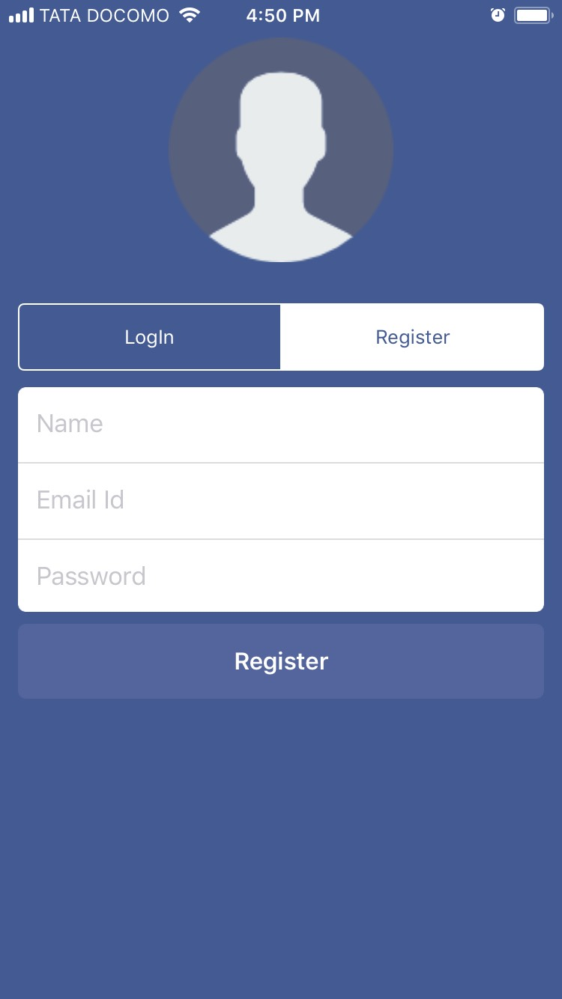
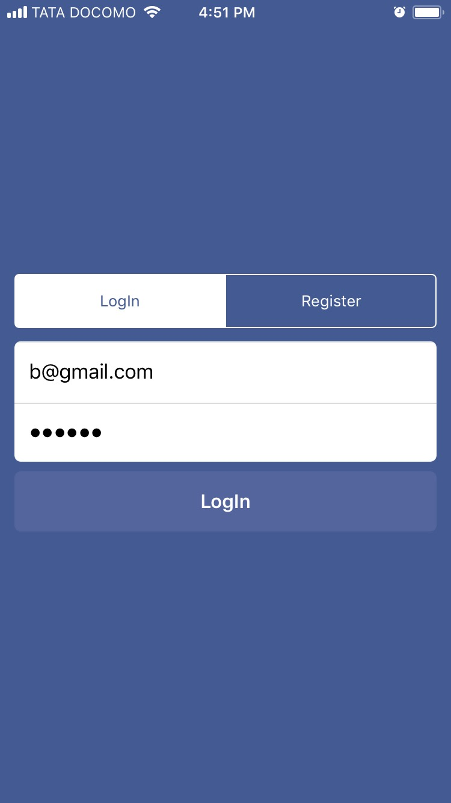
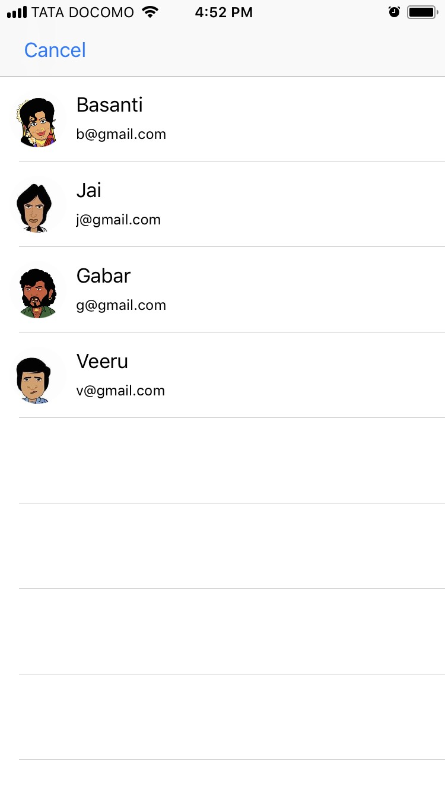
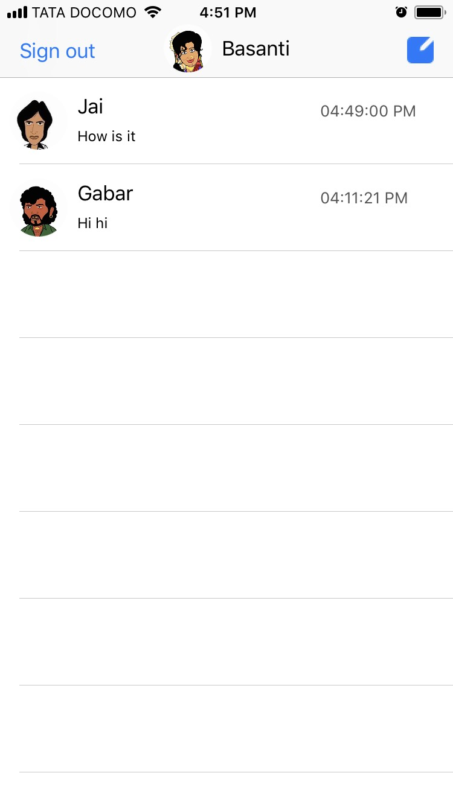
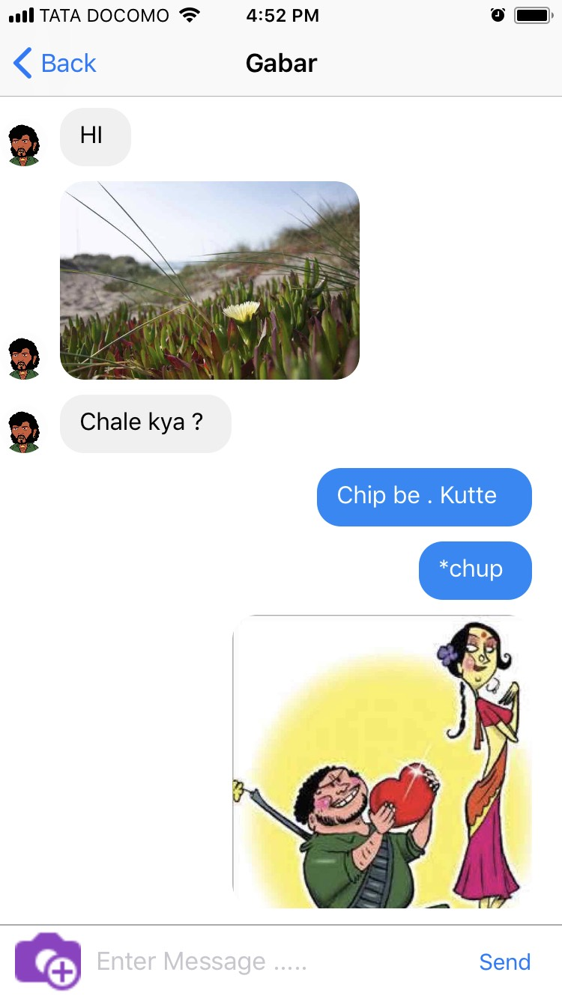
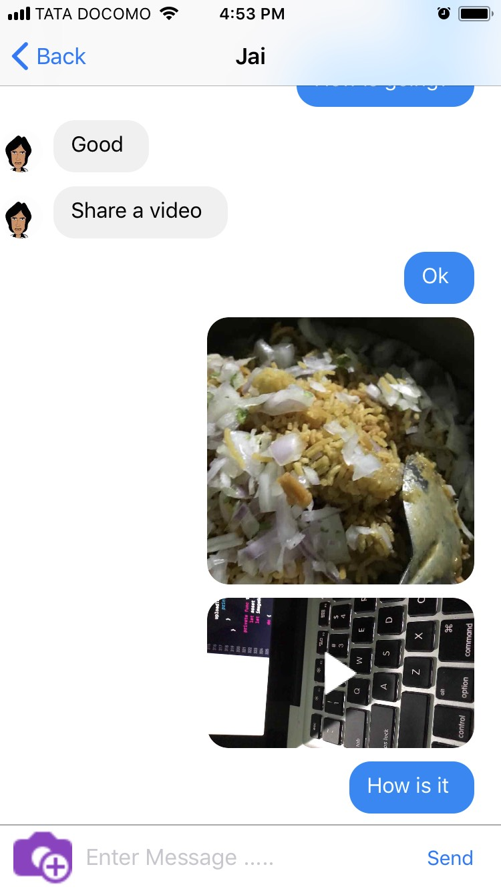

# ChatApp-Swift-And-Firebase
Demo chat app using firebase backend

# About The Project

It my fun learning project . Its about a chat app backend supported by Firebase . Here i have completed user registration . User Log in. End to end real time message sending . Video and Image sharing.
 
# Techincal specification

Xcode 9 , Swift 4.0 , Firebase 4.0.2 

# Run the project 

To run the project go to firebase consol set your own project based on project bundel ID . Generate GoogleService-Info.plist file. Download it add to project . Do explore.

# Found an Issue

Don't hesitate to report an issue . I would love to fix them .

# Screenshot

# Want to contribute ?

send a pull request .
